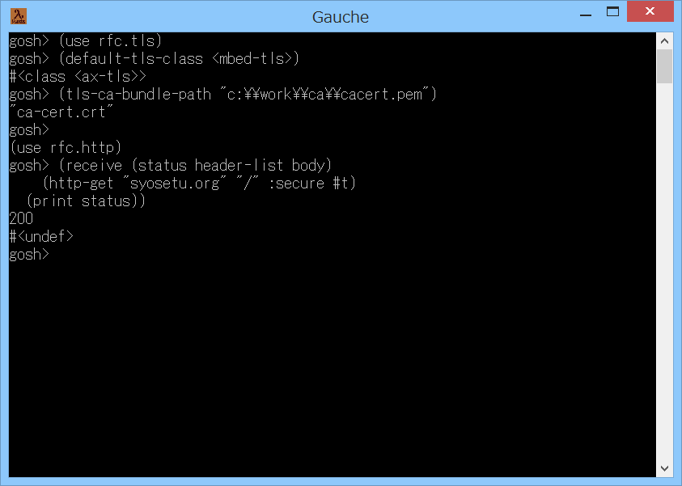

# Gauche-static-mbedtls-mg



## 概要
- Gauche で MSYS2/MinGW-w64 (64bit/32bit) 環境の mbedTLS を使用可能にするためのツールです。  
  実行にはビルドのための開発環境とインターネット接続環境が必要です。

- 本ツールは、libgcc_s_seh-1.dll に依存しない mbedTLS のパッケージを生成します。

- また、Gauche のビルドスクリプトを書き換えて、mbedTLS のサポートを有効にします。


## 実行手順
1. 事前準備  
   事前に、Gauche のインストール、開発環境のインストール、  
   Gauche の開発最新版のソースの取得が必要になります。  
   以下のページを参照して、  
   「3. Gauche のソースのダウンロードと展開」までを実施ください。  
   https://gist.github.com/Hamayama/6666e5d2c8d5167d22f7

2. 本ツールのダウンロードと展開  
   本サイト ( https://github.com/Hamayama/Gauche-static-mbedtls-mg ) のファイルを、  
   (Download Zip ボタン等で) ダウンロードして、適当なフォルダに展開してください。

3. mbedTLS のパッケージファイルの作成  
   シェルからコマンドを実行します。  
   ＜MSYS2/MinGW-w64 (64bit) 環境の場合＞  
   プログラムメニューから MSYS2 の MinGW 64bit Shell を起動して、以下のコマンドを実行してください。  
   ＜MSYS2/MinGW-w64 (32bit) 環境の場合＞  
   プログラムメニューから MSYS2 の MinGW 32bit Shell を起動して、以下のコマンドを実行してください。  
   ( c:\work に本ツールを展開した場合)
   ```
   cd /c/work/Gauche-static-mbedtls-mg
   ./1001_make-static-mbedtls-package.sh
   ```
   しばらくして処理が終了すると、以下のファイルがフォルダ内に生成されます。
   
   |<div align="center">生成ファイル</div>|<div align="center">内容</div>|
   |---|---|
   |mingw-w64-x86_64-mbedtls-2.16.3-1-any.pkg.tar.xz|64bit環境用のパッケージファイル|
   |mingw-w64-i686-mbedtls-2.16.3-1-any.pkg.tar.xz  |32bit環境用のパッケージファイル|
   
   **(注意) 実行にはインターネット接続環境が必要です。  
   ( https://github.com/Alexpux/MINGW-packages にアクセスします )**  
   
   **(注意) 実行には CMake が必要です。存在しない場合には pacman 経由で入れるか、または  
   スタンドアロン版を https://cmake.org/download/ から入手してインストールしてください。  
   そして、スタンドアロン版を使用する場合には、  
   上記 ./1001_make-static-mbedtls-package.sh コマンドのオプションに  
   --use-standalone-cmake を指定してください。  
   (スタンドアロン版の cmake.exe には PATH が通っている必要があります)**  
   
   **(注意) ドキュメントのインストールも必要な場合には、  
   上記 ./1001_make-static-mbedtls-package.sh コマンドのオプションに  
   --include-documents を指定してください。  
   (この場合 Doxygen および Graphviz というツールが必要です)**

4. mbedTLS のパッケージのインストール  
   生成した mbedTLS のパッケージを、開発環境にインストールします。  
   ＜MSYS2/MinGW-w64 (64bit) 環境の場合＞  
   プログラムメニューから MSYS2 の MinGW 64bit Shell を起動して、以下のコマンドを実行してください。  
   ( c:\work に本ツールを展開した場合)
   ```
   cd /c/work/Gauche-static-mbedtls-mg
   pacman -U mingw-w64-x86_64-mbedtls-2.16.3-1-any.pkg.tar.xz
   ```
   ＜MSYS2/MinGW-w64 (32bit) 環境の場合＞  
   プログラムメニューから MSYS2 の MinGW 32bit Shell を起動して、以下のコマンドを実行してください。  
   ( c:\work に本ツールを展開した場合)
   ```
   cd /c/work/Gauche-static-mbedtls-mg
   pacman -U mingw-w64-i686-mbedtls-2.16.3-1-any.pkg.tar.xz
   ```

5. Gauche のビルドスクリプト書き換えツールのコピー  
   本ツールを展開したフォルダにある `2001_modify-mingw-dist.sh` というファイルを、  
   `1.` で展開した Gauche のソースのトップフォルダにコピーしてください。

6. Gauche のビルドスクリプトの書き換え  
   Gauche のビルドスクリプトを書き換えて、mbedTLS のサポートを有効にします。  
   ＜MSYS2/MinGW-w64 (64bit) 環境の場合＞  
   プログラムメニューから MSYS2 の MinGW 64bit Shell を起動して、以下のコマンドを実行してください。  
   ＜MSYS2/MinGW-w64 (32bit) 環境の場合＞  
   プログラムメニューから MSYS2 の MinGW 32bit Shell を起動して、以下のコマンドを実行してください。  
   ( c:\work に Gauche のソースを展開した場合)
   ```
   cd /c/work/Gauche
   ./2001_modify-mingw-dist.sh
   ```
   成功すると、src フォルダの mingw-dist.sh というファイルが書き換えられます。  
   変更前のファイルは mingw-dist_orig1001.sh という名前で残ります。

7. Gauche のビルド  
   Gauche のビルドを行ってください。  
   以下のページを参照して、  
   「5. Gauche のコンパイル」以後を実施ください。  
   https://gist.github.com/Hamayama/6666e5d2c8d5167d22f7

8. 動作確認  
   https://curl.haxx.se/ca/cacert.pem  
   にアクセスして、CA証明書ファイル を入手し、適当なフォルダに配置してください。  
   その後、Gauche (gosh.exe) を起動して、以下を実行してください。  
   ( c:\work\ca\ に CA証明書ファイル を配置した場合)
   ```
   (use rfc.tls)
   (default-tls-class <mbed-tls>)
   (tls-ca-bundle-path "c:\\work\\ca\\cacert.pem")
   
   (use rfc.http)
   (receive (status header-list body)
       (http-get "syosetu.org" "/" :secure #t)
     (print status))
   ```
   200 が返れば成功です。


## その他 注意事項等
1. Gauche や mbedTLS パッケージの将来のバージョンアップにより、  
   動作しなくなる可能性があります。

2. 環境によっては、  
   ./1001_make-static-mbedtls-package.sh の実行中に、以下の警告がたくさん出ます。  
   `「Can't translate gname 'なし' to UTF-8」`  
   
   原因は、makepkg-mingw が内部で使用している bsdtar が、  
   ファイルの所属グループ名の日本語をうまく変換できないためです。  
   
   ただ、生成したパッケージ自体は、そのまま使用可能です。  
   (7-Zip で直接解凍しようとすると、警告が出ますが。。。)  
   
   どうしても対策が必要な場合は、  
   `mkgroup -c -l > /etc/group` を実行して `/etc/group` を作成し、  
   ファイル内の `なし` となっている部分を `None` に置換してください。  
   
   そして、シェルを再起動すると、ファイルの所属グループ名が `None` になり、  
   上記警告は出なくなります。  
   
   ただし、Windows の ユーザアカウントのグループを追加/変更/削除した場合には、  
   `/etc/group` も更新する必要があります。  
   (もしくは、`/etc/group` を削除またはリネームして無効に戻す必要があります)  
   
   ＜参考URL＞  
   https://mattn.kaoriya.net/software/msys/20170519195436.htm


## 環境等
- OS
  - Windows 8.1 (64bit)
- 環境
  - MSYS2/MinGW-w64 (64bit/32bit) (gcc version 9.2.0 (Rev2, Built by MSYS2 project))
  - CMake v3.11.4
- 言語
  - Gauche v0.9.9
  - Gauche v0.9.8
  - Gauche v0.9.7
  - Gauche v0.9.6
- パッケージ
  - mingw-w64-x86_64-mbedtls 2.16.3-1
  - mingw-w64-i686-mbedtls 2.16.3-1

## 履歴
- 2018-7-6   v1.00 (初版)
- 2018-7-6   v1.01 mingw-dist.sh のリネームをやめた
- 2018-7-6   v1.02 生成ファイル名見直し
- 2018-7-6   v1.03 パッケージリストの取得を自動化
- 2018-7-7   v1.04 URL修正(zip → tar.gz)
- 2018-7-12  v1.05 コメント修正のみ
- 2019-12-24 v1.06 パッケージのバージョンを更新(2.9.0-1 → 2.16.3-1)


(2019-12-24)
